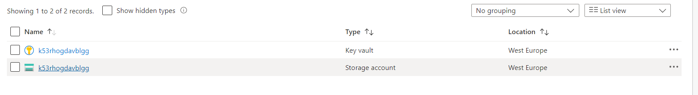
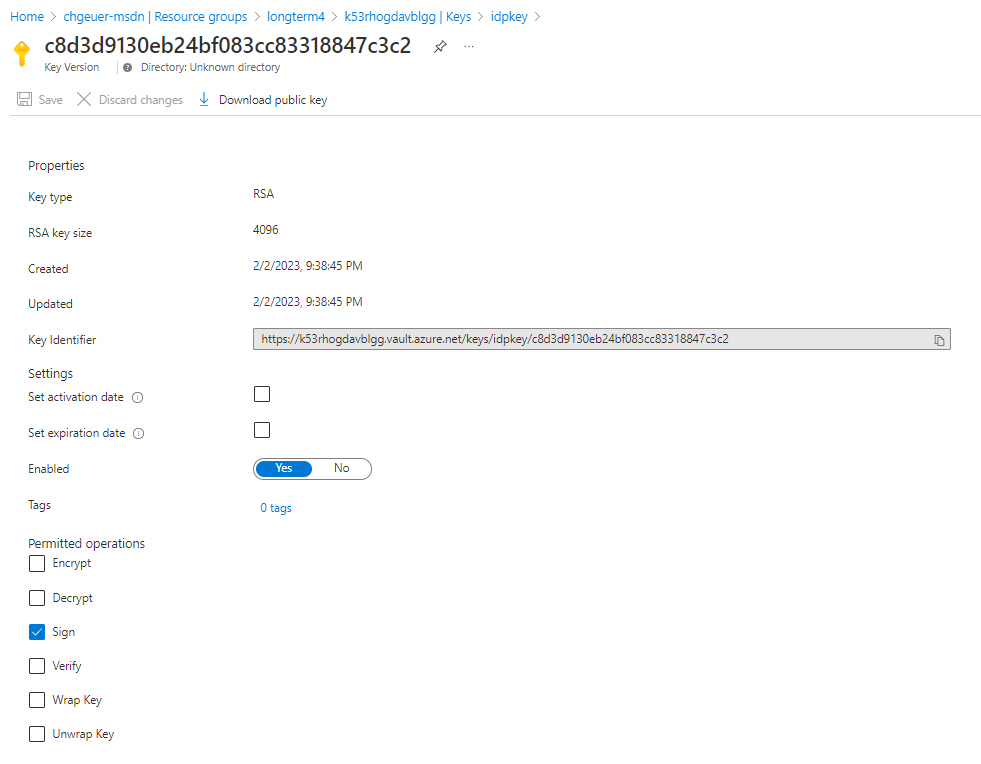
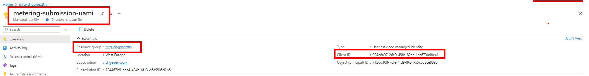
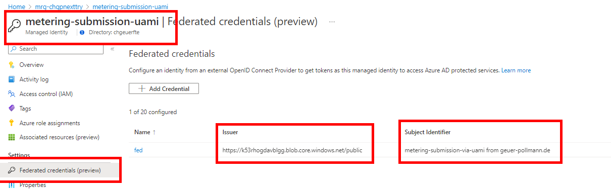

# metering_cloudshell

The ISV resource group with the KeyVault containing the issuance key for workload identity federation, as well as the storage account containing the IdP metadata

https://k53rhogdavblgg.blob.core.windows.net/public/jwks_uri/keys

The token signing key in KeyVault

## The customer side

